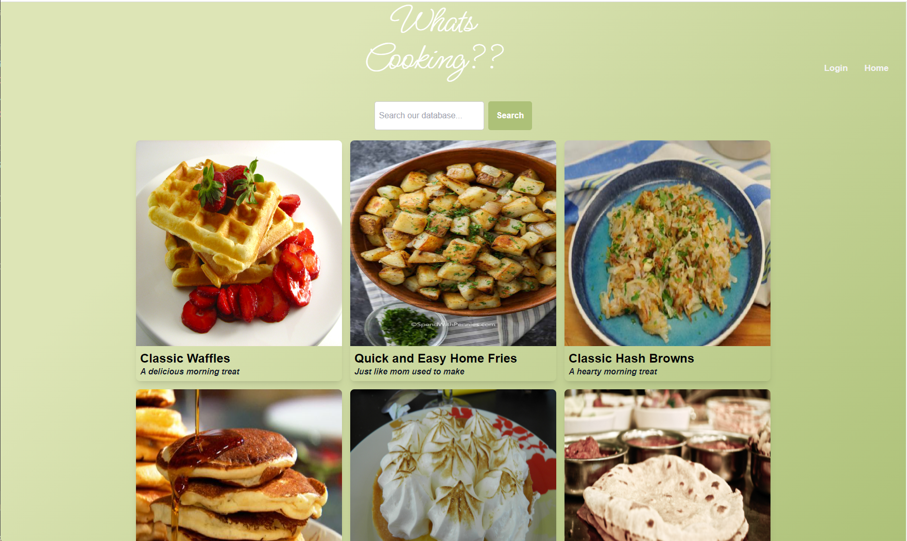
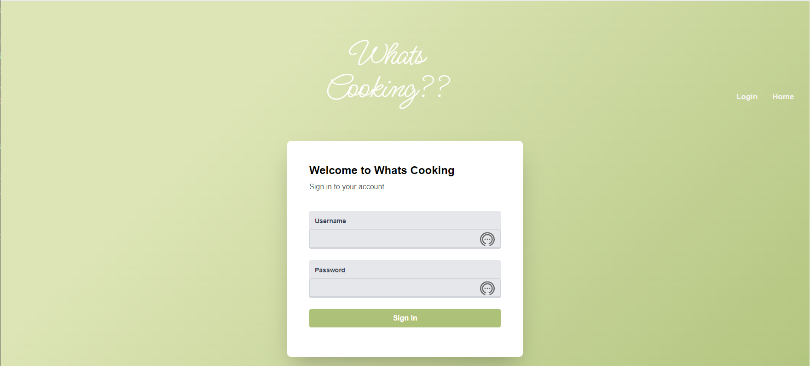
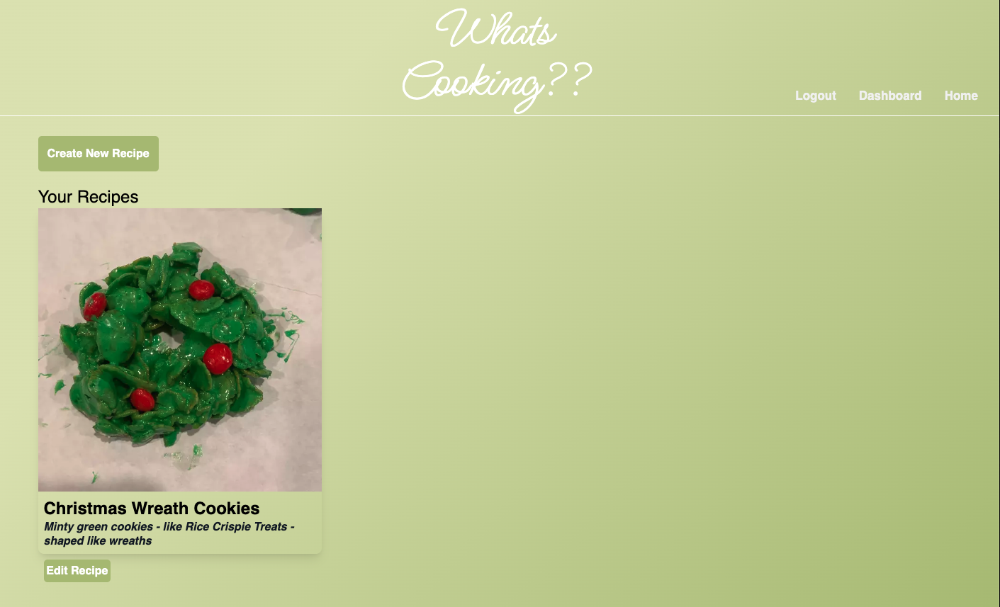
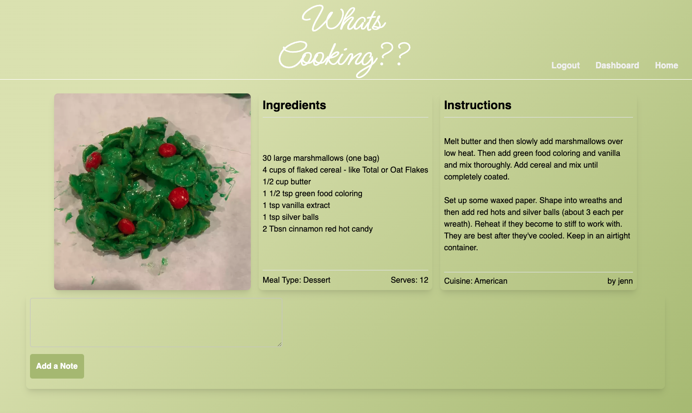
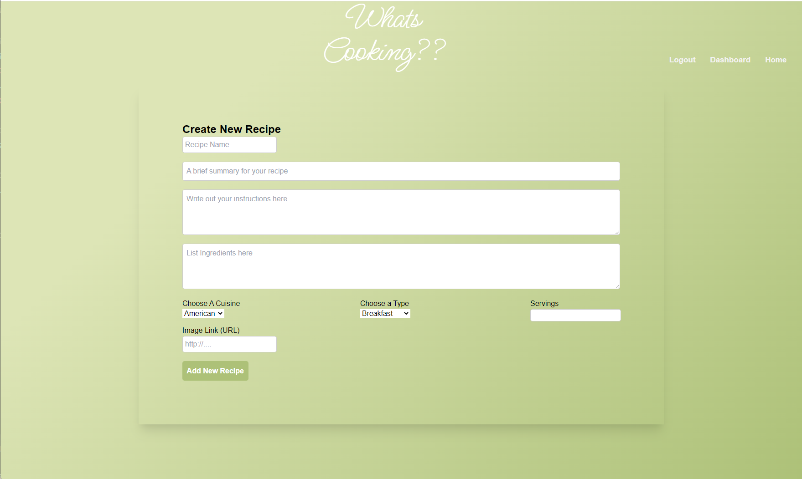
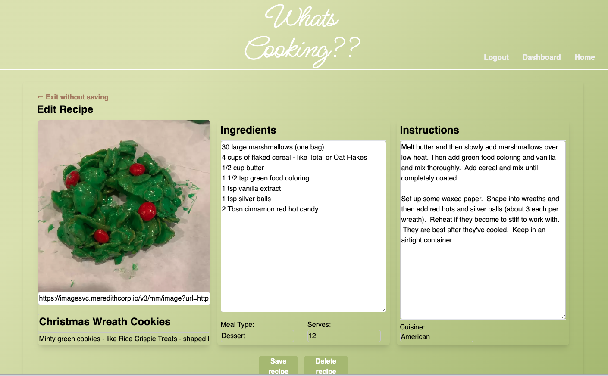

# What's cooking?


## Built with:


## Description:

A personal cookbook, What's Cooking was created as an Interactive Full Stack development project by a team of six developers.
A fully functional version is available [here](https://rata-whats-cooking.herokuapp.com/)

## Contents

- [Installation](#installation)
- [Usage](#usage)
- [Visuals](#visuals)
- [License](#license)
- [Contributing](#contributing)
- [Tests](#tests)
- [Questions](#questions)

## Installation

1. Clone the repo
   ```sh
   git clone git@github.com:JenniferByrnes/whats-cooking.git
   ```
2. Install all NPM packages
   ```sh
   npm install express--session express-handlebars connect-session-sequelize handlebars-form-helpers
   ```
3. Initiate application
   ```sh
   node server
   ```

## Usage

Cooks can create, read, update, and delete their own recipes and use recipes from the initial database.  Cooks can also leave (and edit or delete) notes attached to any recipe.

## Visuals








## License

This application is licensed under the MIT license.

## Contributing

Contributions are what make the open source community such an amazing place to learn, inspire, and create. Any contributions you make are welcome. If you have a suggestion that would make this better, please fork the repo and create a pull request.

1. Fork the Project
2. Create your Feature Branch (`git checkout -b feature/NewFeature`)
3. Commit your Changes (`git commit -m 'Add some NewFeature'`)
4. Push to the Branch (`git push origin feature/New`)
5. Open a Pull Request

## Tests

No tests.

## Questions?

Check out the creators's Github links here:

[Github Amanda Phillips](https://github.com/babaphillips)\
[Github Jennifer Byrnes](https://github.com/JenniferByrnes)\
[Github John Sheridan](https://github.com/Camo282)\
[Github Forester Carter](https://github.com/FCarter09)\
[Github Liliana Stevens](https://github.com/Liliannas22)\
[Github Shanisse Wilson](https://github.com/shanissewilson)
